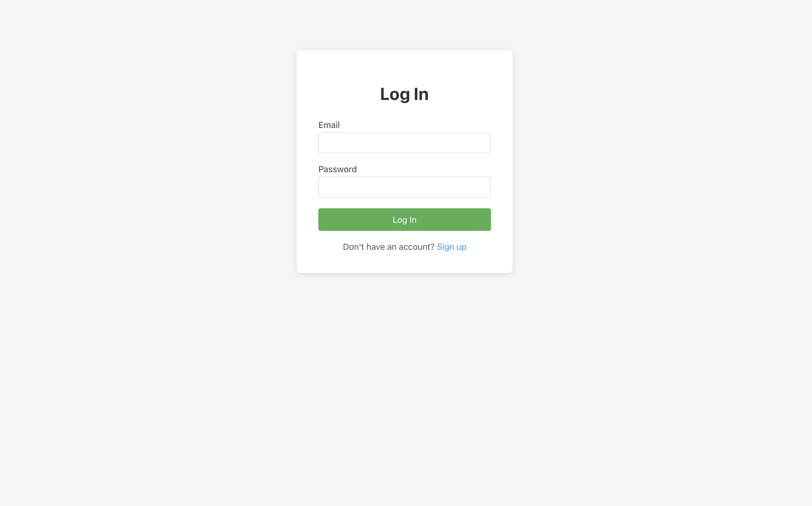
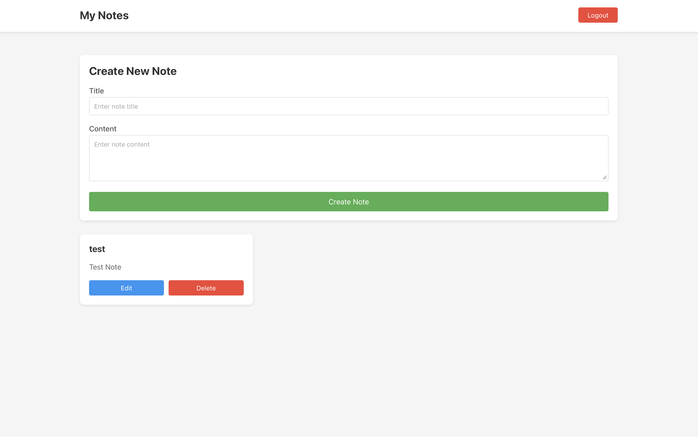

# Notes App

Full-stack note management application with JWT authentication. Built with FastAPI (Python) and Next.js (TypeScript).

## Features

**Backend**
- REST API with FastAPI & SQLAlchemy ORM
- JWT authentication with bcrypt password hashing
- PostgreSQL database with Alembic migrations
- Note ownership enforcement
- 19 pytest tests (100% passing)

**Frontend**
- Next.js 14 with React 18 & TypeScript
- Authentication flow (signup/login)
- Full CRUD notes dashboard
- Loading & error states
- 20 tests: 15 Jest unit + 5 Playwright E2E (100% passing)

## Screenshots

**Login Page**



**Notes Dashboard**



## Project Structure

```
notesApp/
├── backend/           # Python FastAPI backend
│   ├── app/
│   │   ├── api/      # Route handlers
│   │   ├── core/     # Config and security
│   │   ├── models/   # Database models
│   │   ├── schemas/  # Pydantic schemas
│   │   └── tests/    # Pytest tests
│   ├── alembic/      # Database migrations
│   ├── docker-compose.yml
│   ├── requirements.txt
│   └── README.md
│
├── frontend/         # Next.js React frontend
│   ├── app/          # Pages and layouts
│   ├── lib/          # API client
│   ├── __tests__/    # Jest unit tests
│   ├── e2e/          # Playwright E2E tests
│   ├── package.json
│   └── README.md
│
└── README.md         # This file
```

## Quick Start

**Prerequisites:** Python 3.9+, Node.js 18+, PostgreSQL

### Backend Setup

```bash
cd backend
python3 -m venv venv
source venv/bin/activate
pip install -r requirements.txt  # Includes pytest and all test dependencies

# Setup PostgreSQL
brew install postgresql@14
brew services start postgresql@14
createdb notesapp

# Configure environment
cp .env.example .env
# Update DATABASE_URL in .env

# Run migrations and start server
alembic upgrade head
uvicorn app.main:app --reload
```

Backend runs at `http://localhost:8000` • Docs at `http://localhost:8000/docs`

### Frontend Setup

```bash
cd frontend
npm install  # Includes Jest, Playwright, and all test dependencies
npm run dev
```

Frontend runs at `http://localhost:3000`

## Testing

### Test Dependencies Installation

**Backend test dependencies** are automatically installed with:
```bash
cd backend
source venv/bin/activate
pip install -r requirements.txt
```

This includes:
- `pytest` - Testing framework
- `pytest-asyncio` - Async test support
- `httpx` - HTTP client for API testing

**Frontend test dependencies** are automatically installed with:
```bash
cd frontend
npm install
```

This includes:
- `jest` - Unit testing framework
- `@testing-library/react` - React component testing
- `@testing-library/jest-dom` - DOM matchers
- `@playwright/test` - E2E testing framework

### Running Tests

#### Backend Tests (19 tests)

```bash
cd backend
source venv/bin/activate

# Run all tests
pytest

# Run with verbose output
pytest -v

# Run specific test file
pytest app/tests/test_auth.py
pytest app/tests/test_notes.py

# Run with coverage report
pytest --cov=app --cov-report=html
```

**Test Breakdown:**
- **Authentication Tests (7)**: Signup, login, validation, error handling
- **Notes API Tests (12)**: CRUD operations, authorization, ownership validation

#### Frontend Unit Tests (15 tests)

```bash
cd frontend

# Run all unit tests
npm test

# Run in watch mode
npm run test:watch

# Run specific test file
npm test -- login.test.tsx
```

**Test Breakdown:**
- **Login Component (4)**: Form rendering, authentication flow, error states
- **Signup Component (4)**: Registration, validation, error handling
- **Notes Dashboard (7)**: CRUD operations, authentication checks, error handling

#### Frontend E2E Tests (5 tests)

```bash
cd frontend

# Run E2E tests (headless)
npm run test:e2e

# Run with interactive UI (for debugging)
npm run test:e2e:ui

# Run in headed mode (watch browser)
npm run test:e2e:headed

# View detailed test report
npm run test:report
```

**Test Scenarios:**
1. Complete user journey (signup → login → notes access)
2. Login validation and error handling
3. Protected route authentication
4. Full CRUD workflow (create → read → update → delete)
5. Multiple notes management

### Test Coverage Summary

| Type | Count | Framework | Coverage | Status |
|------|-------|-----------|----------|--------|
| Backend Unit/Integration | 19 | pytest | API routes, auth, DB | ✅ |
| Frontend Unit | 15 | Jest + RTL | Components, logic | ✅ |
| Frontend E2E | 5 | Playwright | User workflows | ✅ |
| **Total** | **39** | - | **Full stack** | **✅** |

**All tests passing with 100% success rate.**

## Technology Stack

**Backend:** FastAPI • SQLAlchemy • PostgreSQL • Alembic • JWT • Bcrypt  
**Frontend:** Next.js 14 • React 18 • TypeScript • Jest • Playwright

## Troubleshooting

**Backend**
- Database connection error: `brew services list` to check PostgreSQL
- Port 8000 in use: `lsof -ti:8000 | xargs kill -9`

**Frontend**
- API connection error: Verify backend at `http://localhost:8000/health`
- Port 3000 in use: `PORT=3001 npm run dev`

---
